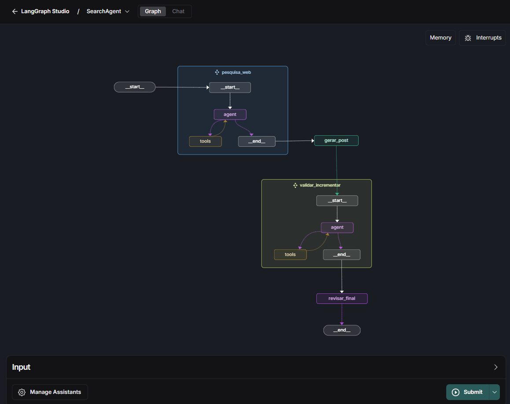
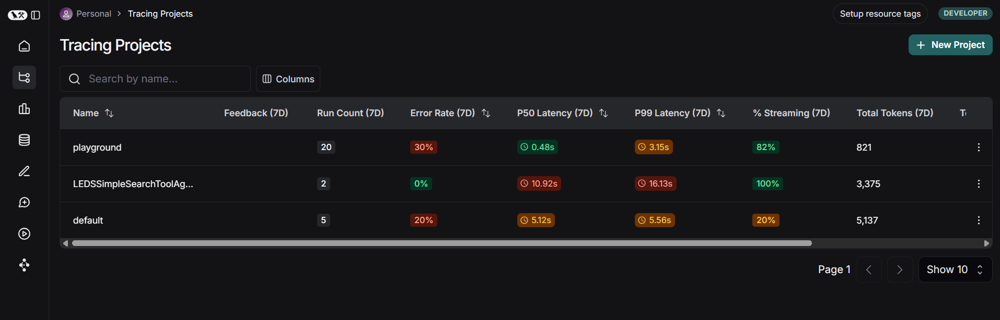

# LangGraph Example Agent Module 🌐🤖

Este projeto cria um sistema modular de agentes inteligentes capazes de buscar informações atualizadas na web usando multimodelos modelo **Gemini-2.5-pro-exp-03-25** e **Gemini-2.0-flash** integrado à **Tavily Search API**, além de gerar, validar e revisar conteúdo com múltiplos agentes orquestrados via **LangGraph** e outras ferramentas personalizadas.

O projeto utiliza a arquitetura **ReAct** para raciocinar sobre perguntas recebidas e executar ações externas (como buscas online) para construir respostas completas e atualizadas.

### 🌟 Destaques:
- Integração com **LangSmith** para rastreamento (tracing) das execuções dos agentes.
- Arquitetura modular e expansível com suporte a múltiplos agentes em cadeia.
- Execução interativa com **LangGraph CLI** ou scripts diretos.

---

## 🛠️ Tecnologias Utilizadas

- [Python 3.12+](https://www.python.org/)
- [LangGraph](https://github.com/langchain-ai/langgraph)
- [LangChain Core](https://github.com/langchain-ai/langchain)
- [LangChain Google Generative AI (Gemini)](https://github.com/langchain-ai/langchain/tree/main/libs/langchain-google-genai)
- [LangChain Community Tools (Tavily)](https://github.com/langchain-ai/langchain/tree/main/libs/langchain-community)
- [Tavily Search API](https://app.tavily.com/)
- [python-dotenv](https://pypi.org/project/python-dotenv/)
- [LangSmith (tracing para agentes LangChain)](https://pypi.org/project/langsmith/)

---

## 📦 Estrutura do Projeto

```
LangGraphExampleAgentModule-main/
├── .env.example                   # Exemplo de variáveis de ambiente
├── .gitignore                     # Arquivos/diretórios ignorados pelo Git
├── README.md                      # Arquivo de documentação do projeto
├── agent.py                       # Script principal para execução de agentes
├── config.py                      # Configurações gerais do projeto
├── image-1.png                    # Imagem ilustrativa do projeto
├── image.png                      # Outra imagem do projeto
├── langgraph.json                 # Configuração JSON do grafo LangGraph
├── main.py                        # Entrada principal do projeto
├── requirements.txt               # Dependências do projeto
├── tools.py                       # Ferramentas auxiliares
├── agents/                        # Módulo com a lógica dos agentes
│   ├── __init__.py
│   ├── chains.py                  # Definição das cadeias de execução dos agentes
│   ├── create_agents.py           # Criação e configuração dos agentes
│   ├── graph_builder.py           # Construção do grafo de execução
│   ├── nodes.py                   # Definição dos nós (funções) do grafo
│   ├── personas.py                # Configuração de personas usadas pelos agentes
│   ├── state.py                   # Definição do estado compartilhado no grafo
│   └── utils.py                   # Utilitários diversos

```



---

## ✨ Funcionalidades Adicionais

- **Fluxo com Múltiplos Agentes:**
  - Agente 1: Pesquisa contextualizada na web.
  - Agente 2: Geração de conteúdo (ex: posts).
  - Agente 3: Validação e incremento do conteúdo.
  - Agente 4: Revisão final com otimização textual.

- **Integração com LangSmith:** Registro automático de execuções.
- **Função `run_agent` com decorator `@traceable`:** Rastreia interações.
- **Execução direta com exemplo integrado.**



---

## ⚙️ Configuração e Instalação

1. **Clone o repositório:**

```bash
git clone https://github.com/profmoisesomena/LangGraphExampleAgentWithTracing.git
cd LangGraphExampleAgentWithTracing
```

2. **Crie e ative um ambiente virtual:**

```bash
python3.12 -m venv .venv
source .venv/bin/activate  # Linux / MacOS
# ou
.venv\Scripts\activate      # Windows
```

3. **Instale as dependências:**

```bash
pip install -r requirements.txt
pip install -U "langgraph-cli[inmem]"
```
4. **Configure as variáveis de ambiente:**

```bash
cp .env.example .env
```
5. **Preencha o .env com suas chaves de API:**

```
GEMINI_API_KEY=your_gemini_api_key_here
TAVILY_API_KEY=your_tavily_api_key_here
LANGSMITH_API_KEY=your_langsmith_api_key_here
```
## 🚀 Como Rodar o Agente:**

6. **Ambiente interativo com LangGraph:**

```bash
langgraph dev
```
 Sobre o langgraph.json:<br>Este arquivo é usado para configurar e gerenciar múltiplos agentes, rotas e parâmetros de execução personalizados no LangGraph.

7. **Execução direta no terminal:**

```bash
python main.py
```


## 🤝 Contribuindo
Contribuições Sugestões, melhorias e correções pertinentes são bem-vindas. 

Encontrou um problema? Abra uma issue.

Quer melhorar o agente? Envie um pull request!
